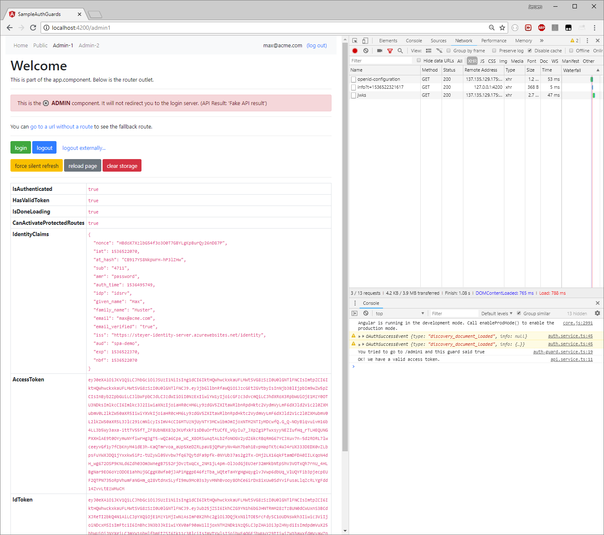

# Example angular-oauth2-oidc with AuthGuard

This repository shows a basic Angular CLI application with [the `angular-oauth2-oidc` library](https://github.com/manfredsteyer/angular-oauth2-oidc) and Angular AuthGuards.

## Usage

This repository has been scaffolded with the Angular 5 CLI.
Make sure you have the CLI globally installed.
Then:

1. Clone this repository
1. Run `npm install` to get the dependencies
1. Run `ng serve --open` to get it running on [http://localhost:4200](http://localhost:4200)

This connects to the IdentityServer also used in the library's example.
The **credentials** are user "`max`" and password "`geheim`".

You could also connect to your own IdentityServer by changing `auth-config.ts`.
Note that your server must whitelist both `http://localhost:4200/index.html` and `http://localhost:4200/silent-refresh.html` for this to work.

## Example

The application is supposed to look somewhat like this:

